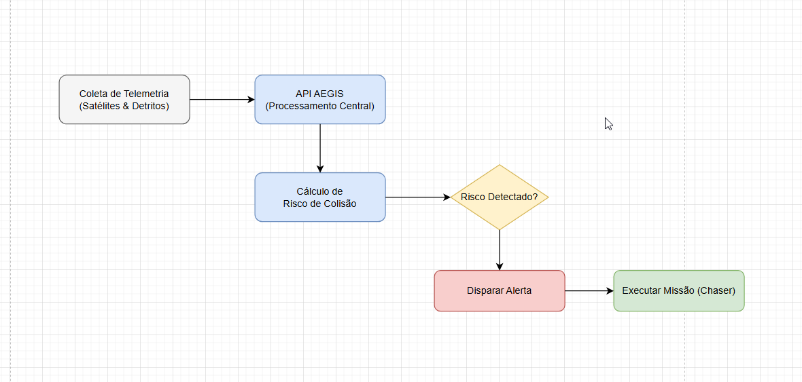

"""# 🛰️ AEGIS - Plataforma de Gestão de Lixo Espacial

Projeto desenvolvido para otimizar a segurança orbital através da monitorização e gestão de detritos espaciais.

---

## 👥 Equipe
**Representante do Grupo:** 👤 **Pamella Christiny Chaves Brito** | `RM565206`

* 👤 **João Pedro Pereira Camilo** | `RM562005`
* 👤 **Lucas Matsubara Reis** | `RM565020`

---


## ☁️ Infraestrutura e Deploy (Azure)
Para este projeto, utilizamos uma infraestrutura em nuvem (Azure) com as seguintes configurações:

* **Nome da VM:** `aegis-gestao-detritos-espaciais`
* **Grupo de Recursos:** `GS_AEGIS`
* **IP Público:** `20.63.73.247`
* **Credenciais de Acesso:**
    * Usuário: `Admlnx`
    * Senha: `Fiap@2tdsvms`
* **Portas Utilizadas:** `8080`, `1521`, `9090`
* **Identificação de Containers:** Os nomes dos containers seguem um padrão de versionamento que inclui o RM da representante (`565206`) para rastreabilidade e organização acadêmica.

---

## 🎥 Vídeos de Apresentação
- [▶️ Vídeo de Explicação (Infra/Cloud)](https://youtu.be/y5fYgRVep60?si=vz71w5pOeTuaXz-I)
- [▶️ Video Pitch](https://youtu.be/QwVvUHkri4o?si=vpOtBC50kf3HHxid)
- [▶️ Apresentação do Projeto](https://youtu.be/qSeSL6MJgXI?si=GoC5-d16NxOGiAkA)

---

## 1. Problema Abordado
O crescimento exponencial de detritos espaciais em órbita terrestre baixa (LEO) — fenômeno conhecido como **Síndrome de Kessler** — cria uma ameaça crítica à integridade de satélites ativos, infraestruturas de telecomunicações e tripulações. Atualmente, a gestão dessas ameaças é fragmentada, com a ausência de um sistema centralizado que correlacione, em tempo real, a trajetória de detritos perigosos com a localização de ativos espaciais.

## 2. Objetivos da Solução
A Plataforma AEGIS visa transformar a segurança orbital através de:
* **Monitoramento Centralizado:** Consolidar dados de ativos e detritos em uma base íntegra.
* **Automação de Resposta:** Reduzir a latência operacional através de missões de interceptação automatizadas.
* **Visibilidade de Risco:** Permitir o cálculo imediato de risco de colisão.
* **Gestão de Ciclo de Vida:** Acompanhar desde a identificação do risco até a execução da missão.

---

## 3. Requisitos Técnicos
* **Arquitetura:** API REST com separação de camadas (Controllers, Services, Repositories).
* **Persistência:** Banco de Dados Oracle.
* **ORM:** Entity Framework Core.
* **Relacionamentos:** Mapeamento de 1:N e N:N conforme as regras de negócio.
* **Gestão de Banco:** Uso de Migrations para versionamento do esquema.

---

Aegis - Gestão de Detritos Espaciais
1. Descrição do Projeto
O sistema Aegis é uma solução robusta voltada para a catalogação, monitoramento e gestão de detritos espaciais em órbita terrestre. Desenvolvido com uma arquitetura de microsserviços e conteinerização, o projeto visa garantir a sustentabilidade das operações espaciais através de uma API de alta performance que gerencia dados de detritos e empresas responsáveis.

2. Arquitetura do Projeto
O sistema utiliza uma abordagem conteinerizada para garantir a portabilidade e facilidade de deploy.

API: Desenvolvida em .NET 8 (ASP.NET Core).

Banco de Dados: Oracle Database 23ai Free (via Docker).

DevOps: Orquestração completa via docker-compose.

3. Como Executar o Projeto (How-to)
Pré-requisitos
Git instalado.

Docker e Docker Compose instalados.

Passos para execução
Clone o repositório:

Bash
git clone https://github.com/Portifolio-Pamella/aegis-gestao-de-detritos-espaciais-Devops.git
cd aegis-gestao-de-detritos-espaciais-Devops
Suba os containers:

Bash
sudo docker compose up -d --build
Verifique se os serviços estão ativos:

Bash
sudo docker ps
Acesso ao Swagger:
Abra seu navegador e acesse: http://<IP-DO-SERVIDOR>:8080/swagger/index.html

5. Exemplos de Teste (Ordem de Execução)
IMPORTANTE: Devido às chaves estrangeiras (Foreign Keys) do banco relacional, os registros devem ser criados seguindo esta ordem rigorosa.

**IMPORTANTE:** Devido às chaves estrangeiras (Foreign Keys) do banco relacional, os registros devem ser criados seguindo esta ordem rigorosa para evitar erros de integridade.

---

#### Passo 1: Criar Empresa
```json
{
  "nome": "SpaceX Solutions",
  "cnpj": "12345678000199",
  "paisOrigem": "EUA",
  "status": "ATIVO"
}

Passo 2: Criar Detrito
JSON
{
  "nome": "Detrito-001",
  "massaKg": 150.5,
  "tamanhoMetros": 2.5,
  "coordenadaX": 10.5,
  "coordenadaY": 20.0,
  "coordenadaZ": 30.5
}
Passo 3: Criar Satélite
(Use o ID da empresa criada no Passo 1)

JSON
{
  "numeroSatelite": "STAR-001",
  "altitudeKm": 550.5,
  "empresaId": 1
}
Passo 4: Criar Alerta
(Use o ID do Satélite e Detrito criados nos passos anteriores)

JSON
{
  "sateliteId": 1,
  "detritoId": 1,
  "statusGravidade": "ALTA"
}
Passo 5: Criar Chaser
JSON
{
  "nome": "Chaser-Alfa-01",
  "bateria": 95,
  "coordenadaX": 10.5,
  "coordenadaY": 20.0,
  "coordenadaZ": 5.0
}
Passo 6: Criar Missão de Interceptação
(Use o ID do Alerta e Chaser criados nos passos anteriores)

JSON
{
  "alertaId": 1,
  "chaserId": 1,
  "dataExecucao": "2026-06-05T14:26:54.896",
  "status": "PENDENTE"
}
"""

4. Testes e Evidências
Executando o CRUD via Swagger
Para testar a funcionalidade, utilize a interface do Swagger acessada no passo acima:

Localize o controlador DetritosEspaciais ou Empresa.

Realize o POST (criação). Nota: Certifique-se de preencher todos os campos obrigatórios.

Utilize o GET para verificar a persistência.

Utilize o PUT para atualizar registros.

Utilize o DELETE para remover registros.

Validando a Persistência no Banco (Oracle)
Para evidenciar que os dados estão sendo gravados no Oracle:

### Instalação de Dependências
No terminal, dentro da pasta do projeto, execute:
```bash
dotnet add package Microsoft.EntityFrameworkCore
dotnet add package Microsoft.EntityFrameworkCore.Design
dotnet add package Oracle.EntityFrameworkCore
dotnet add package Microsoft.AspNetCore.Mvc